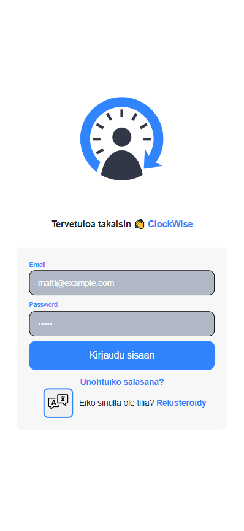
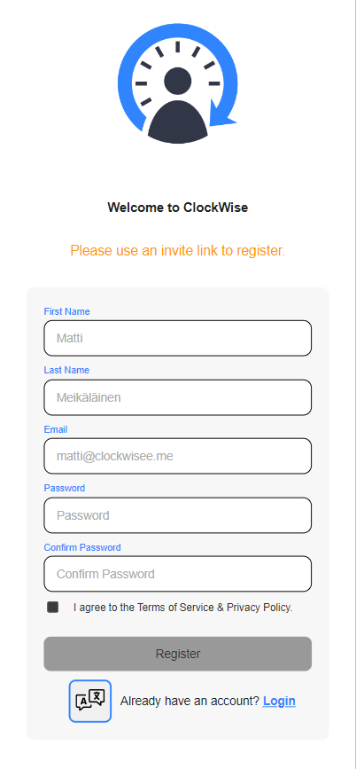
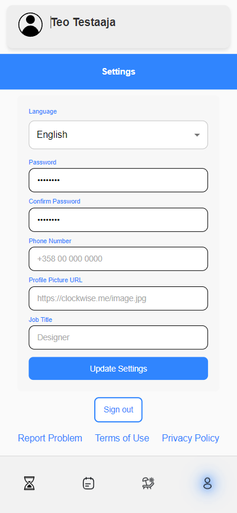

# Clockwise GUI

* [Kohderyhmä](#kohderyhmä)
* [Toiminnallisuudet](#toiminnallisuudet)
* [Sovelluksen Käyttö](#sovelluksen-käyttö)
  * [Kokeile Sovellusta](#kokeile-sovellusta)
  * [Kirjautumisnäkymä](#kirjautumisnäkymä)
  * [Rekisteröintinäkymä](#rekisteröintinäkymä)
  * [Salasanan Palautus](#salasanan-palautus)
  * [Dashboard](#dashboard)
  * [Raportit](#raportit)
  * [Lomat ja Poissaolot](#lomat-ja-poissaolot)
  * [Asetukset](#asetukset)
  * [Manager - Hallintapaneeli](#manager---hallintapaneeli)
  * [Manager - Tyntekijän vierailu](#manager---tyntekijän-vierailu)
  * [Manager - Asetukset](#manager---asetukset)
  * [Admin - Hallinnointipaneeli](#admin---hallinnointipaneeli)
  * [Admin - Yrityksen luonti](#admin---yrityksen-luonti)
  * [Admin - Managerin luonti](#admin---managerin-luonti)
* [API](#api)
* [Testausohjeet](#testausohjeet)
  * [Admin](#admin)
  * [Manager](#manager)
  * [Työntekijä](#työntekijä)
  * [Managerin seurantatoiminnot](#managerin-seurantatoiminnot)
* [Paikallinen Kehitys](#paikallinen-kehitys)
* [Anna Palautetta](#anna-palautetta)

## Kohderyhmä

Clockwise-mobiilisovellus on luotu palvelemaan pieniä ja keskisuuria yrityksiä, jotka kaipaavat dynaamista ja joustavaa työajan hallintaa. Sovelluksen käytön helppous ja kustannustehokkuus tekevät siitä ihanteellisen valinnan niille, jotka haluavat päästä eroon tarpeettomista hallinnollisista taakoista. Intuitiivinen käyttöliittymä mahdollistaa työaikojen ja poissaolojen nopean kirjaamisen, jolloin yritykset voivat keskittyä olennaiseen: ydinliiketoimintaansa.

Esimerkiksi logistiikka-alalla, missä ruokakuljetusyritykset kohtaavat haasteita työntekijöiden tuntien manuaalisen seurannan kanssa, Clockwise tarjoaa ratkaisun. Sen sijaan, että työntekijät ilmoittaisivat toteutuneita tunteja tekstiviestillä tai pikaviestisovelluksessa – menetelmä, joka on altis unohduksille ja virheille – Clockwise mahdollistaa työtuntien kirjaamisen heti niiden toteutuessa. Tämä järjestelmä paitsi säästää aikaa, myös poistaa epäselvyydet ja auttaa varmistamaan, että jokainen työtunti kirjataan oikein ja oikea-aikaisesti.

## Toiminnallisuudet

- Työajan Leimaus: Työntekijät voivat leimata työaikansa mobiilisti, simuloimaan perinteisen leimauskortin käyttöä.
- Poissaolojen Hallinta: Helppo tapa kirjata lomat, sairauspoissaolot ja muut poissaolot.
- Raportointi ja Analytiikka: Automatisoitu raportointi työtunneista ja poissaoloista tiimi- ja yritystasolla.
- Kutsujärjestelmä: Managerit voivat lähettää kutsuja uusille työntekijöille ja hallita tiimiään sovelluksessa.
- Monikielisyys: Sovellus tukee useita kieliä, mahdollistaen monikulttuurisen käytön.
- Käyttäjäprofiilien Hallinta: Mahdollisuus hallita henkilökohtaisia tietoja ja työhistoriaa.
- Intuitiivinen Käyttöliittymä: Sujuva käyttäjäkokemus vähemmän teknisesti orientoituneillekin käyttäjille.
- Reaaliaikainen Seuranta: Näe työntekijöiden status reaaliajassa, parantaen työn suunnittelua.

## Sovelluksen Käyttö

### Kokeile Sovellusta

<https://clockwisee.me>

### Kirjautumisnäkymä

_Kirjautumisnäkymä, jossa käyttäjät voivat kirjautua sisään._

### Rekisteröintinäkymä

_Rekisteröintinäkymä uusille käyttäjille._

### Salasanan Palautus

_Salasanan palautusnäkymä unohtuneita salasanoja varten._

### Dashboard

_Käyttäjän dashboard, josta voi leimata itsensä sisään ja ulos, sekä näkee päivittäiset aktiviteetit ja työajan kirjaukset._

### Raportit

_Raporttinäkymä, joka näyttää työtunnit ja mahdolliset ylityöt._

### Lomat ja Poissaolot

_Lomien ja poissaolojen merkintäsivu._

### Asetukset

_Asetussivu, jossa käyttäjät voivat muokata omia tietojaan._

### Manager - Hallintapaneeli

_Manager-roolin sivu, josta hän voi vallita työntekijöitään_

### Manager - Tyntekijän vierailu

_Manager-roolin sivu, josta hän näkee työntekijän roolintyötunnit_

### Manager - Asetukset

_Manager-roolin sivu, josta hän voi muokata asetuksiaan_

### Admin - Hallinnointipaneeli

_Admin-roolin sivu, josta hän voi tarkastella kaikkia yrityksiä ja niiden henkilöstöä_

### Admin - Yrityksen luonti

_Admin-roolin sivu, josta hän voi luoda uusia yrityksiä_

### Admin - Managerin luonti

_Admin-roolin sivu, josta hän voi lisätä managereita_

## API

Clockwise-sovelluksen GraphQL API:n koodikanta löytyy osoitteesta [og-metropolia/clockwise-api](https://github.com/og-metropolia/clockwise-api).

## Testausohjeet

Tässä ovat yksityiskohtaiset ja selkeät ohjeet kolmelle roolille: Admin, Manager ja Työntekijä, mobiilisovelluksen testaamiseen:

### Admin

- **Kirjaudu sisään Adminina.**
  - Käytä sähköpostia `admin@clockwisee.me` ja salasanaa `12345` kirjautuaksesi sovellukseen mobiililaitteellasi osoitteessa: <https://clockwisee.me/login>
- **Yrityksen ja Managerin Luominen.**
  - Luo yritys "Create Company" -välilehdestä.
  - Luo manager "Add Manager" -välilehdestä. Otathan managerin sähköpostin ja salasanan talteen! Käytäthän samaa yritys tunnusta kuin aikaisemmassa vaiheessa!
  - Jaa managerin tunnukset sille henkilölle joka testaa kyseistä roolia käyttäen jotain viestintäkanavaa.
- **Adminin Asetusten Muuttaminen.**
  - Siirry footerin oikeassa alakulmassa sijaitsevaan "Settings" -välilehteen.
  - Asetusten muokkaaminen on estetty tässä versiossa, jotta voimme taata kaikille hyvän testauskokemuksen. Asetusten muokkaamista voi testata manager ja työntekijä roolin käyttäjillä.

### Manager

- **Kirjaudu sisään Managerina.**
  - Käytä adminin antamia tunnuksia kirjautuaksesi sovellukseen osoitteessa: <https://clockwisee.me/login>
- **Navigoi asetuksiin.**
  - Siirry sovelluksen oikeasta alakulmasta "Settings"-kohtaan, joka löytyy ukko-ikonin kautta.
- **Lähetä kutsulinkki.**
  - Kopioi "Invite to company" -linkki oikeasta alakulmasta.
  - Lähetä kutsulinkki henkilölle joka testaa työntekijä roolia käyttäen jotain viestintäkanavaa.
- **Muuta Managerin tietoja.**
  - Tässä näkymässä voit muuttaa Managerin henkilökohtaisia tietoja ja sovelluksen kieltä.

### Työntekijä

- **Luo käyttäjätunnus.**
  - Avaa Managerin lähettämä linkki mobiililaitteellasi ja luo käyttäjätunnus.
- **Kirjaudu sisään ja testaa toimintoja.**
  - **Time Log:** Kirjauduttuasi sisään, kokeile "Check In" ja "Check Out" -leimausta.
  - **Report:** Siirry footerista "Report"-välilehteen ja katso toteutuneita työtunteja.
  - **Poissaolot:** Siirry seuraavaan välilehteen footerissa, muokkaa poissaoloja valitsemalla ajanjakso ja syy, ja tallenna. Voit valita ajanjakson syöttämällä päivämäärät tai käyttämällä kalenteria.
  - **Asetukset:** Navigoi "Settings"-kohtaan, muuta käyttäjätietoja tai sovelluksen kieltä ja päivitä asetukset.

### Managerin seurantatoiminnot

- **Tarkastele toteutuneita tunteja.**
  - Siirry footerin navigointipalkista "Management"-välilehdelle.
  - Valitse työntekijä nähdäksesi hänen kirjaamansa työtunnit.

Testatessa keskittykää erityisesti käyttöliittymän sujuvuuteen ja toiminnallisuuteen mobiililaitteilla, dokumentoikaa kaikki havainnot, ja antakaa yksityiskohtaista palautetta kehittäjille.

## Paikallinen Kehitys

Jos haluat kehittää sovellusta paikallisesti, noudata seuraavia ohjeita:

1. Kloonaa repositorio paikalliselle koneellesi.
2. Asenna pnpm käymällä osoitteessa [pnpm installation](https://pnpm.io/installation).
3. Suorita `pnpm install` asentaaksesi riippuvuudet.
4. Käynnistä paikallinen palvelin suorittamalla `pnpm run dev`.

## Anna Palautetta

Kutakin tiimiä pyydetään antamaan yksi yhteinen palaute. Muistathan, että formin luojalle näkyy, kuka on vastannut. Käytä alla olevaa linkkiä palautteen antamiseen. Kiitos panoksestanne!

[Palautelomake](https://forms.office.com/Pages/DesignPageV2.aspx?prevorigin=shell&origin=NeoPortalPage&subpage=design&id=12EaTaW2ZE-Hh_B0-HAT7vL9n9KAjfBFlFvZ30PlTgVUQ1VBVjBSUDUwVkU3S00xUE8yQlRDN1NKUy4u&analysis=false)
